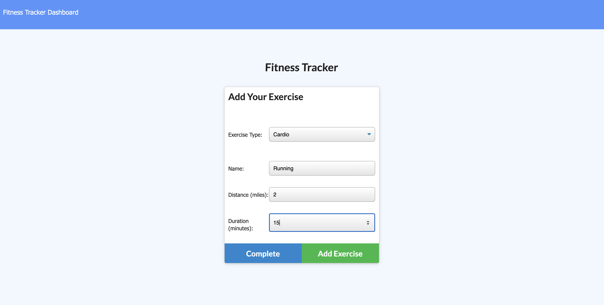
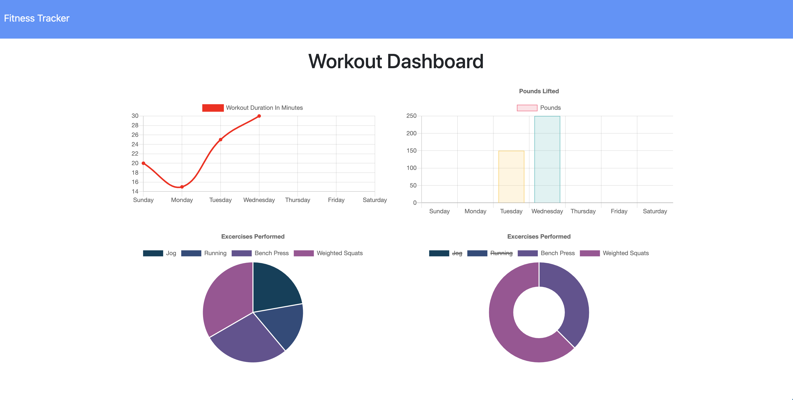

# Track-Fit
Track-Fit allows users to log multiple exercises and create a personalized workout program.  This app includes a comprehensive stat report that helps users visualize their progress!

## Table of Contents
1. [About](#about)
2. [Languages Used](#languages)
3. [Contributing](#contribute)
3. [Access & Appearance](#access) 

## About 

Keep track of your workouts with Track-Fit.  It is built with a Mongo database, mongoose schema, and express routes.

## Languages and Technologies Used 

Powered by:
- Mongo
- Node.js
- Express.js

## Contributing 

If you are interested in contributing to this project, feel free to fork this repository and open a pull request to suggest changes.

## Access and Appearance 

<a href="https://floating-headland-30522.herokuapp.com/?id=5f5d7e8ac24e5a001702762f" target="_blank">LINK to application</a>

